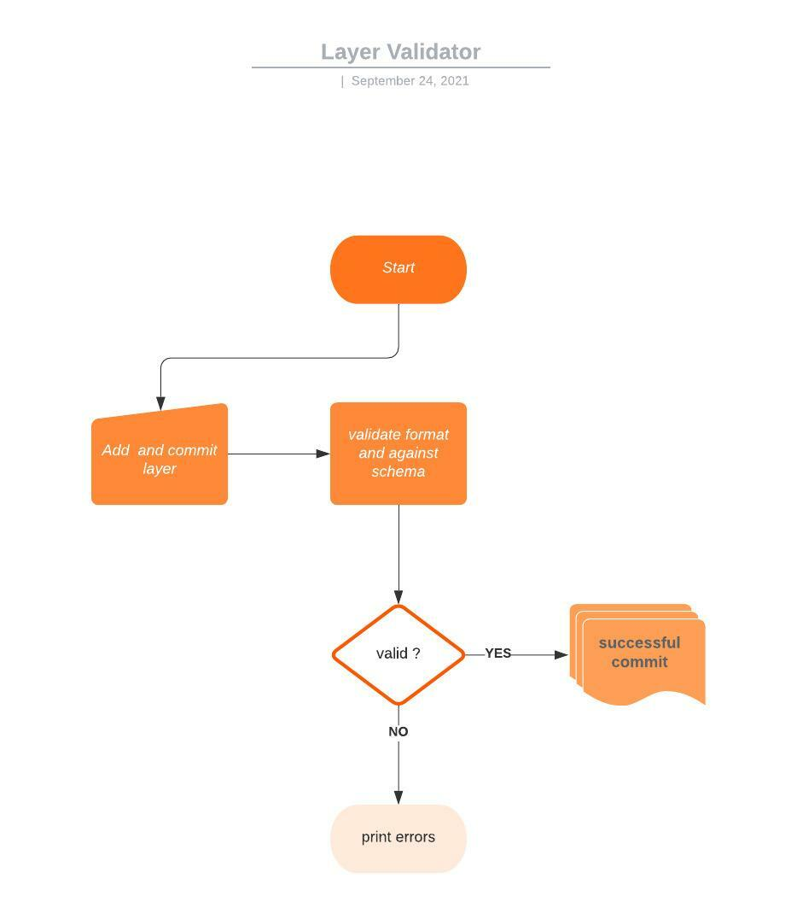

# Cyclone Idai

Shared data and layers for Cyclone Idai

# Layer Validator



Updating layer specifications only to find you missed a comma or some curly brackets after hours of starring on your screen can be a pain. Such errors can be hard to detect when reviewing data, and may lead to unwanted bugs on stage and production instances. The layer validator seeks to check the formats of all JSON files on commit and ensure all layers are validated against respective schemas before pushing files remotely. 

On commit, json files will be validated against declarative schemas using [ajv schema validator](https://ajv.js.org/). Schemas can be generated from all existing layers by running ` npm run generate `, this is based on a schema generator [jsonschema.net](https://jsonschema.net/) which adheres to json schema specifications. For ease of access and as a convention, all schemas should have the same names as the layer that generated them. Schemas for various layers can be found inside validation-schema directory located in the root directory.

## Usage

To validate all layers in the repository

```js
// Pre-requisite for all npm related commands    (installs npm packages)
npm install

// Validates all layers against provided schema
npm run validate

// Validate a single layer
npx ajv -s validation-schema/<schema name> -d moz/<directory>/ <layer name> --strict=false;

// Generates schemas for all layers (Not necessarry if you have no new layers)
npm run generate

// Generate schema for a single layer
json-schema-generator <layer json> -o validation-schema/<schema name (should be same as the layer name)

```

On `git commit` a format and schema validation will run against all committed  JSON files inside moz folder.
